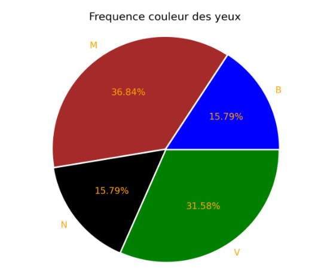
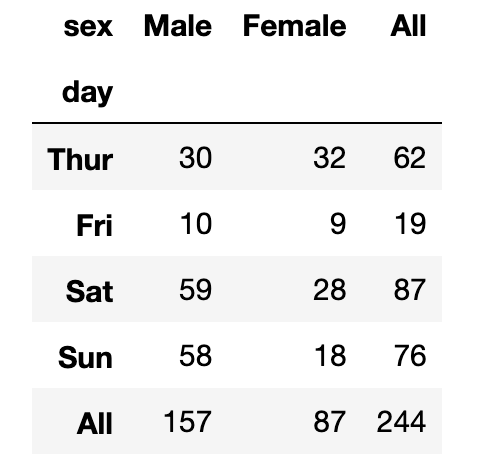
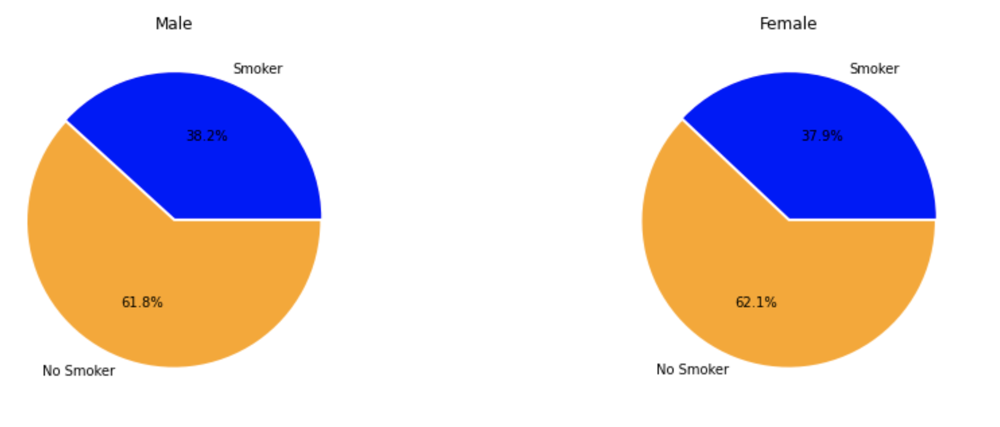
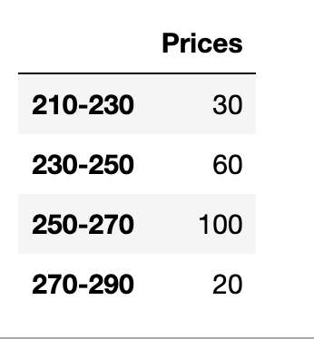
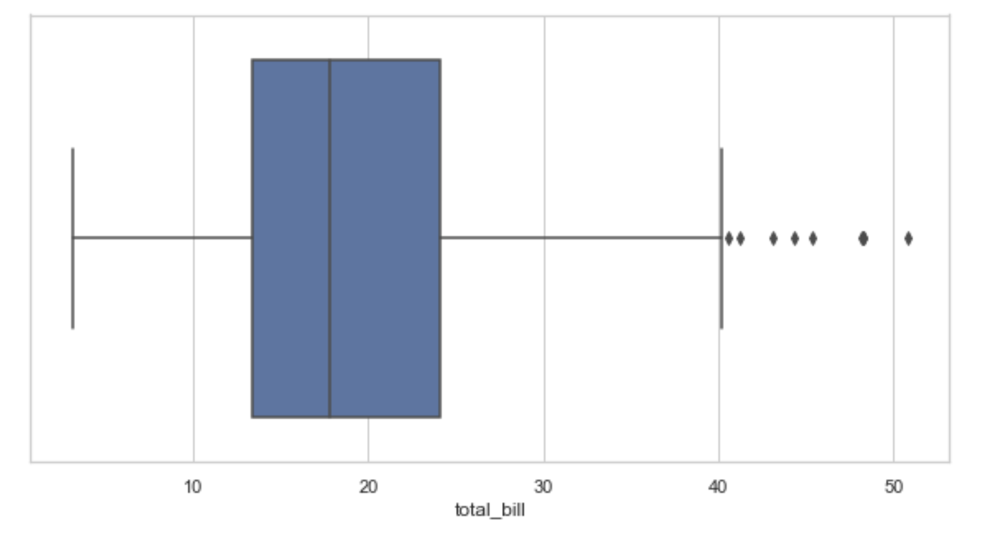

# Descriptive généralites

Une variable statistique est dite :

## Quantitative

- **quantitative** : lorsqu'elle est mesurée par un nombre (les Notes des Etudiants à l'Examen de Statistique, le Chiffre d'Affaire par PME, le Nombre d'Enfants par Ménage, . . . ).

On distingue 2 types de variables quantitatives :

- les variables quantitatives discrètes
- Les variables quantitatives continues.

Par exemple le nombre d'enfants par ménage ne peut être que 0, ou 1, ou 2, ou 3, . . .C'est une variable quantitative discrète.

Les variables **quantitatives continues** peuvent prendre toute valeur dans un intervalle. Par exemple, le chiffre d'affaire par PME, le temps d'attente à un arrêt de bus.

## Qualitative

Lorsque les modalités (ou les valeurs) qu'elle prend sont désignées par des noms. Par exemples, les modalités d'une variable Sexe peuvent être : Masculin et Féminin.

On distingue deux types de variables qualitatives : les variables qualitatives ordinales et les variables qualitatives nominales.

Plus précisément une variable qualitative est dite **ordinale**, lorsque ses modalités peuvent être classées dans un certain ordre naturel (c'est par exemple le cas d'une variable commen Mention au Bac).

Une variable qualitative est dite **nominale**, lorsque ses modalités ne peuvent être classées de façon naturelle (c'est par exemple le cas d'une variable comme Couleur des Yeux ou encore de la variable Sexe).

## 01 Exercice fréquences marginales et représentation circulaire

Récupérez le dataset dans student.csv, dans le dossier data et étudiez le critère couleur des yeux.

1. Créez un DataFrame avec les données dans le dossier data. Renommez les colonnes Couleur des yeux et mention au bac respectivement par eye_color et mention.

2. Edutiez le critère "eye_color". Créez un nouveau DataFrame dans lequel vous calculerez les fréquences marginales.

- Utilisez un groupby

3. Créez à partir du tableau précédent un diagramme en secteur pour visualiser la répartition de la couleur des yeux.

- Indications : pour créer un diagramme en secteur utilisez matplotlib, utilisez l'approche objet.

```python
import matplotlib.pyplot as plt
# Une figure dans ax <=> tableau Numpy
fig, ax = plt.subplots(figsize=(5, 5))
```



## pd.crosstab table croisé

```python
import seaborn as sns
# Data tips
tips = sns.load_dataset("tips")
```

**Dataset tips** 

Aux Etats Unis les pourboires donnés aux serveurs constituent une composante majeur de leurs rémunération.

Durant le début de l'année 1990 un serveur d'un restaurant à enregistrer les pourboires des clients durant 2,5 mois.

Nous allons utilisez le dataset tips (pourboires) de seaborn.

Voici les données en colonnes expliquées dans ce jeu de données, chaque ligne représente un pourboire donné par un client.

- total_bill (total du prix du repas)

- tip (pourboire)

- sex

- smoker 

- day

- time : Dinner or Lunch

- size : nombre de personne à une table


La méthode crosstab permet de générer un tableau croisé avec les fréquences des facteurs, mais vous pouvez également passer une fonction d'agrégation pour ces facteurs. 

Le nombre de pourboire donné par jour et par sex peut être représenté par le tableau croisé suivant, notez l'attribut margins permet de calculer les fréquences marginales

```python
pd.crosstab(tips['day'], tips['sex'], margins=True)
```



### Définition d'une fréquence conditionnelle

Elle se calcule relativement par rapport à une sous population, par exemple dans le Dataset tips la population des femmes.

## 02 Exercice fréquences conditionnelles

1. si on prend la table croisé du nombre de pourboires pour les 2.5 mois par rapport au critère sex et smoker, on aimerait avoir les fréquences conditionnelles suivantes :

- Fréquence des fumeurs parmi les femmes, puis les hommes qui ont donné un pourboire.

- Fréquence des non fumeurs parmi les femmes, puis les hommes qui ont donné un pourboire.

2. Créez des diagrammes circulaires représentant ces fréquences 




## 03 Exercice notes en statistique

Récupérez le dataset **note_statistiques.csv** et faite un diagramme en baton des notes en statistiques.

1. Renommez la colonne Notes examen de statistiques en Notes.

2. Quelle est le type de la variable notes ?

3. Ajoutez une colonne Frequence pour la fréquence des notes de notre dataset.

4. Faites maintenant 5 classes pour regrouper vos notes à l'aide de la fonction suivante de Pandas :

```python
 pd.qcut( notes['Notes'], 5, labels = ['0-4', '4-8', '8-12', '12-16', '16-20'])
```

5. Faites un diagramme circulaire pour représenter la répartition des notes.

6. La classe modale est la classe dont la fréquence par unité d'amplitude est la plus élevée. Déterminez cette classe en fonction du graphique précédent.


*Remarques pour effectuez un diagramme de type Histogramme vous pouvez également partir du DataFrame lui-même voyez l'exemple suivant*

```python
classNotes['Effectifs'].plot(kind='bar');
```

## Valeurs centrales

### Définition du mode (précision)

Le mode correspond à la valeur de la variable pour laquelle l'effectif (ou la fréquence) est le plus grand.

Recensement des familles dans la population dont le nombre d'enfants de moins de 14 ans.

| Nombre d'enfants |     Nombre de famille    |
| ---------------  |  ----------------------: |
| 0                |        2601              |
| 1                |        6290              |
| 2                |        2521              |
| 3                |        849               |
| 4                |        137               |

Ici c'est la valeur 1.

## Remarques

Certaines variables peuvent présenter plusieurs modes.

### 04 Exercice variable continue

| Prix             |     Effectifs            |
| -------------    |  ----------------------: |
| ]210, 230]       |        30                |
| ]230, 250]       |        60                |
| ]250, 270]       |        100               |
| ]270, 290]       |        20                |
|                  |        total = 210       |

1. Créez un histogramme à partir des données suivantes. Pensez à créer un DataFrame; déterminez enfin le mode de la série statistique.

2. Quel est le type de la variable Prix ?

Indications nous donnons le format des données ci-dessus sous forme d'un dictionnaire nous aimerions avoir le DataFrame suivant :

```python
p = { 'Prices' : ['210-230', '230-250', '250-270', '270-290'] , 'Effectifs' : [30, 60, 100, 20] }
```



## Médiane et Quantile

Ces objets sont des **indicateurs de position** en statistiques. Au même titre que la moyenne.

La médiane (notée Me ) d'une variable quantitative est la valeur de cette variable qui permet de scinder la population étudiée en deux sous-populations de même effectif.


## Définition de l'intervalle interquartile

### Rappels sur Q1, Q2, Q3

On appelle quartiles **les 3 valeurs** de la variables qui partagent l'effectif, rangé par ordre croissant, en quatre sous-ensembles égaux : Q1, Q2, Q3.

Q1 : premier quartile 25% des valeurs sont inférieurs ou égale à Q1

Q2 : mediane 50% des valeurs sont inférieurs ou égale à Q2.

Q3 : troisième quartile 75% des valeurs sont inférieurs ou égale à Q3

Min : la plus petite valeur.

Max : la plus valeur valeur.


### Définition interquartile

*C'est la différence entre le troisième quartile et le premier
quartile ; il s’écrit : $II = Q_3 - Q_1$.*

## 06 Exercice Quartile notes

Si la valeur n'est pas entière dans le calcul on prendra la valeur supérieur (convention française). Pour le calcul de la médiane il se fait, si la série est de longueur paire, en prenant la position donnée par le calcul et en prennant la valeur qui suit et en faisant la moyenne de ces deux valeurs.

 Soit la série suivantes : 10; 25; 30; 40; 41; 42; 50; 55; 70; 101; 110; 111

 1. Déterminez le troisième quartile.

 2. La médiane.

 3. L'intervalle interquartile.

Même exercice avec la série statistique suivante, répondez aux 3 questions :

Soit la série suivantes : 10; 25; 30; 40; 41; 42; 50; 55; 70; 101; 110; 111, 208

## Diagramme en moustache

La boîte à moustaches résume quelques **indicateurs de position** d'un caractère étudié (médiane, quartiles, minimum, maximum ou déciles).

Une boîte à moustache aide à se représenter les données. Notons que 50% des valeurs sont à l'intérieur de la boîte. De même 50% des valeurs sont positionnées sur les moustaches, en deux intervalles de 25%. De plus lorsqu'on réalise un diagramme à moustache, on voit directement les valeurs extrêmes.

Ce diagramme est très utilisé **principalement** pour comparer un même caractère dans deux populations de tailles différentes.



Notez que les valeurs extèmes n'apportent en elle-même pas d'information particulière pour l'étude d'un critère donné.

### 07 Exercice d'application

Utilisez seaborn. Rappelons que Seaborn est une bibliothèque pour faire des graphiques statistiques en Python. Il est construit au-dessus de matplotlib et étroitement intégré aux structures de données de Pandas.

```python
%matplotlib notebook
import seaborn as sns
import matplotlib.pyplot as plt
# définiton d'un style de type grille sous fond blanc
sns.set(style="whitegrid")
```

Rappels de configuration pour vos graphiques dans Notebook :

- %matplotlib notebook conduira à des tracés interactifs intégrés au notebook.

- %matplotlib inline conduira à des images statiques de votre tracé dans un notebook.

Fixez également la taille de vos graphiques dans votre Notebook :

```python
fig_dims = (20, 15)
fig, ax1 = plt.subplots(figsize=fig_dims)

ax2 = sns.boxplot(x="Name_variable1", y="Name_variable2", ax=ax1, data=MyDataFrame)
plt.show()
```

Utilisez la méthode boxplot de Seaborn :

```python
# x et y sont des variables (colonnes) de votre DataFrame
# kind indique le type de graphique que vous souhaitez utiliser, ici box pour les diagrammes en moustache
# data représente le jeu de données
ax = sns.boxplot(x="Name_variable1", y="Name_variable2", data=MyDataFrame)
plt.show()
```

Récupérez le jeu de données sur les tips intégré dans Seaborn à l'aide du code suivant :

```python
tips = sns.load_dataset("tips")
```

1. Etudiez la dispertion des données de la variable **total_bill** pour vous faire une idée du positionnement des valeurs.

2. Etudiez maintenant la position des variables du total des additions par jour.

3. Utilisez maintenant le paramètre **hue** dans la méthode boxplot. Il permet de faire un regroupement imbriqué par deux variables catégorielles. Etudiez le positionnement de la variable total_bill par jour, par rapport à la variable nominale (ou catégorielle pour Pandas et Seaborn) "smoker".

4. Récupérez maintenant le jeu de données suivant :

```python
iris = sns.load_dataset("iris")

```

Etdudiez la position des variables suivantes : le spécimen et la taille des pétales.

## Indicateurs de dispersion

On dispose d'une population de N individus, et on observe x_1 , . . . , x_N, les valeurs d'une variable quantitative discrète X pour ces individus.

### Définition de l'étendue

L'étendue de la variable X quantitative discrète est la différence entre la plus grande et la plus petite des valeurs observées.

$e = max(X_i) - min(X_i)$ où i décrit l'ensemble des valeurs de la variable X.

### Variance et écart type

La variance de la variable quantitative X, notée par Var(X), est, par définition, la moyenne arithmétique des carrés des écarts à la moyenne arithmétique.

$Var(X)=\frac{1}{n}\sum_{i=1}^{n}(X_i - \bar{X})^2$, $\bar{X}$ représente la moyenne.

Quand la série prend les valeurs $x_1, x_2, ..., x_k$ avec les fréquences $f_1, f_2, ..., f_k$, sa variance est :

$Var(X)=\sum_{i=1}^{k}f_i \times(X_i - \bar{X})^2$

## 08 Exercice calcul de la variance

1. Soit la série statistique suivante :

```python
Notes = [7, 9, 11, 12, 13, 15]
```

Ecrire un script en Python qui permet de calculer la variance de cette série. Pensez à utiliser numpy.

2. Soit le tableau de notes d'une classe suivant :

| Note             |     Effectif             |
| -------------    |  ----------------------: |
| 7                |        5                 |
| 9                |        4                 |
| 11               |        21                |
| 12               |        35                |
| 13               |        32                |
| 15               |        3                 |

2.1 Calculez la moyenne des notes de cette classe.

2.2 Déterminez la médiane. Faites un script en Python.

2.3 Déterminez la variance. Utilisez le code précédent en Python pour calculer la variance.

2.4 On définit l'écart type comme étant la racine de la variance. Calculez l'écart type des notes de cette classe.

3. L'enseignant augment toutes les notes de 1 point. Quelle conséquence cela a pour les calculs précédents ?

## Violinplot

 Il montre la distribution des données quantitatives à plusieurs niveaux d'une (ou plusieurs) variable(s) catégorielle(s) afin de pouvoir comparer ces distributions.

Le tracé de violon présente une estimation de la densité du noyau de la distribution sous-jacente.

### 09 Exercice Titanic

Récupérez le dataset du Titanic :

```python
# Chargement du dataset
titanic = pd.read_csv('https://raw.githubusercontent.com/agconti/kaggle-titanic/master/data/train.csv')

titanic.head()
```

Dans une autre cellule préparez seaborn :

```python
%matplotlib inline
from matplotlib import pyplot as plt
import seaborn as sns
sns.set(style="ticks", color_codes=True)
```

Créez le violinplot suivant :

```python

sns.violinplot(data=titanic, y='age', x='survived')

plt.show()
```

Que pouvez-vous dire, de manière évidente sur l'age, par rapport aux graphiques et la prédiction x ?
