# Covariance linéaire

## Présentation

La covariance **indique ou mesure le degré de dépendance** entre deux variables X et Y.

Plus la dépendance entre X et Y est grande plus la covariance est forte.

**Le fait que deux variables est une grande covariance ne démontre pas qu'il y ait une relation de causalité entre l'une et l'autre.** Dans la littérature on prend souvent l'exemple d'un dataset  de cygognes, d'un pays donné, et du nombre de naissances. On montre alors que la corrélation est forte entre ces deux variables : Nombre de cygognes & Naissances. Il est évident, ici, qu'il n'y a pas de relation entre ces deux variables apriori... donc la corrélation et causalité sont deux choses distinctes.

Deux variables X et Y peuvent être liées par une relation mathématiques de type affine, de type puissance ou même exponentiel.

Nous allons par la suite aborder les relations affines entre deux variables.

## Relation affine

La covariance de X et Y deux variables (aléatoires) est définie par :

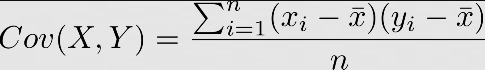

Que l'on peut écrire également sous cette forme :

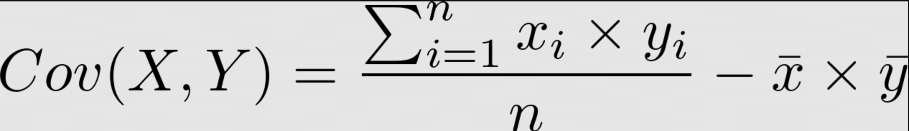

Lorsqu'il y a une relation linéaire, la corrélation est forte et une droite passera en moyenne assez proche de tous les points. Dans le graphique suivant les points semblent suivre une direction donnée.


## Centre de gravité

Les axes avg(x) et avg(y) représentent le centre de gravité du nuage de point.

Dans les deux situations suivantes les variables X et Y sont dépendantes.

Les produits positifs s'additionnent dans la formule plus haut, et donne une quantité non négligeable positive. Les variables X et Y sont donc apparamment dépendantes.

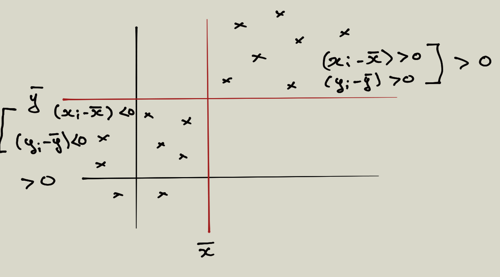

Inversement des quantités négatives peuvent s'additionner. On dira que les variables X et Y sont dépendantes négativement.

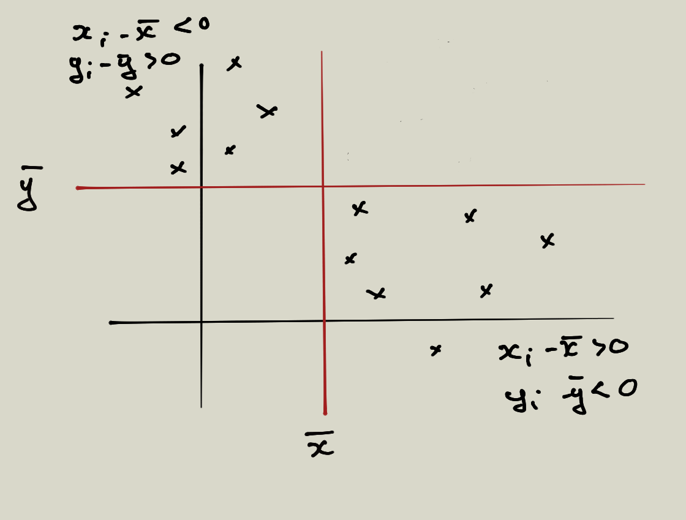

## Exemple de deux variables dépendantes

Ci-dessous le prix des loyers en fonction de la surface en m2 dans une ville de France.

| Surface en m2    |     Prix des loyers      |
| ---------------  |  ----------------------: |
| 19               |        280               |
| 30               |        485               |
| 39               |        615               |
| 52               |        670               |
| 65               |        865               |
| 79               |        1080              |
| 92               |        1260              |
| 108              |        1645              |

## 01 Exercice calculer la covariance

1. Créez un DataFrame à partir des valeurs suivantes et créez une fonction cov(x,y) permettant de calculer la covariance de deux variables. Attention il existe une méthode **cov** dans Pandas, celle-ci vous donnera la covariance non-biaisée statistique ne l'utilisez pas pour l'instant.

```python
import numpy as np
import pandas as pd

area = [19,30,39,52,65,79,92,108]
price = [280 ,485  ,615  ,670  ,865  ,1080 ,1260 ,1645 ]

df = pd.DataFrame({'area' : area, 'price' : price})

def cov(x,y):
    pass

```

2. Supposons maintenant que l'on change l'unité de mesure de la surface et que l'on prenne des cm pour mesurer la surface des habitations. Que pouvez-vous dire de la covariance que vous avez calculer précédemment ?

Faites le calcul en changement chacune des unités en cm2.

## Normaliser les valeurs

Nous allons introduire la notion de cœfficient corrélation linéaire qui est un réel compris entre -1 et 1. Il permet de mettre nos variables dans le même rapport de valeur, dans ce cas l'unité n'a plus d'effet sur nos calculs.


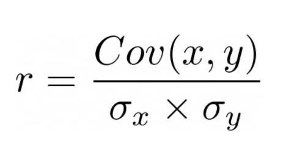

Ce cœfficient **n'a pas d'unité de mesure** et est toujours compris entre -1 et 1. On l'appelle **cœfficient de corrélation de Pearson.**

## 01 (suite) Exercice calculer la covariance

Reprennez l'exercice précédent et mettez en évidence l'effacement de la différence des mesures avec le cœfficient corrélation linéaire.

## Coefficient

On admettra que si r est proche de 1 ou -1 il y a une forte corrélation linéaire entre les deux variables X et Y.

Voici un tableau qui vous aidera dans l'interprétation des valeurs de ce cœfficient :

| Cœfficient       |     Interprétation       |
| ---------------  |  ----------------------: |
| 0                |   pas de corrélation     |
| -0.25            |   Faible corrélation <0  |
| -0.75            |   Forte corrélation <0   |
| -1.0             |   Parfaite corrélation <0|
| 0.25             |   Faible corrélation >0  |
| 0.75             |   Forte corrélation >0   |
| 1.0              |   Parfaite corrélation <0|

### 02 Exercice fonction de corrélation

Créez une fonction **corr** en Python permettant de calculer la corrélation.

```python
def corr(x,y):
    pass
```

Reprennez l'exercice précédent et déterminez la corrélation entre les deux variables area et price. Que pouvez-vous conclure ?

Si vous souhaitez calculer la variance sans degré de liberté avec Numpy voyez ce qui suit, cette fonction cov de Numpy vous donnera la matrice des covariances.

```python
np.cov(df.area, df.price, ddof=0)
```

## 03 Exercice d'application avec Pandas

Soit les données suivantes que l'on représente en nuage de points comme suit :

```python
%matplotlib inline
import pandas as pd
import numpy as np
import matplotlib.pyplot as plt

df = pd.DataFrame({
    'X' :  np.arange(5)+3,
    'Y' : [1, 3, 4, 8, 12]  
})

plt.scatter(
    df['X'], df['Y'],
    s=200,
    c='red',
    marker = '*',
    edgecolors = 'blue'
)

plt.show()
```

Avec Pandas vous pouvez calculer le cœfficient de Pearson de corrélation de deux variables, cette méthode vous retournera la matrice de corrélation, elle est symétrique.

```python
df.corr(method='pearson')
```

Donnez le cœfficient de corrélation des variables X et Y.

Que pouvez-vous dire des variables X et Y ?

## Exemples de corrélation forte

```python
x = [-5, -4, -3, -2, -1, 0, 1, 2, 3, 4, 5]
y = [-5, -4.1, -3, -2, -1.1, 0, 1.3, 2.2, 3, 4.1, 5]

df2 = pd.DataFrame({'x' : x, 'y' : y})

df2.corr(method='pearson')
```

|    | X                |     Y       |
|:---| ---------------  |  ---------: |
|  X | 1                |  0.999461   |
|  Y | 0.999461         |  1          |


Vous pouvez tracer la droite qui passe au plus proche de ces points à l'aide du module searborn :


```python
sns.lmplot(x="x", y="y", data=df2)
```

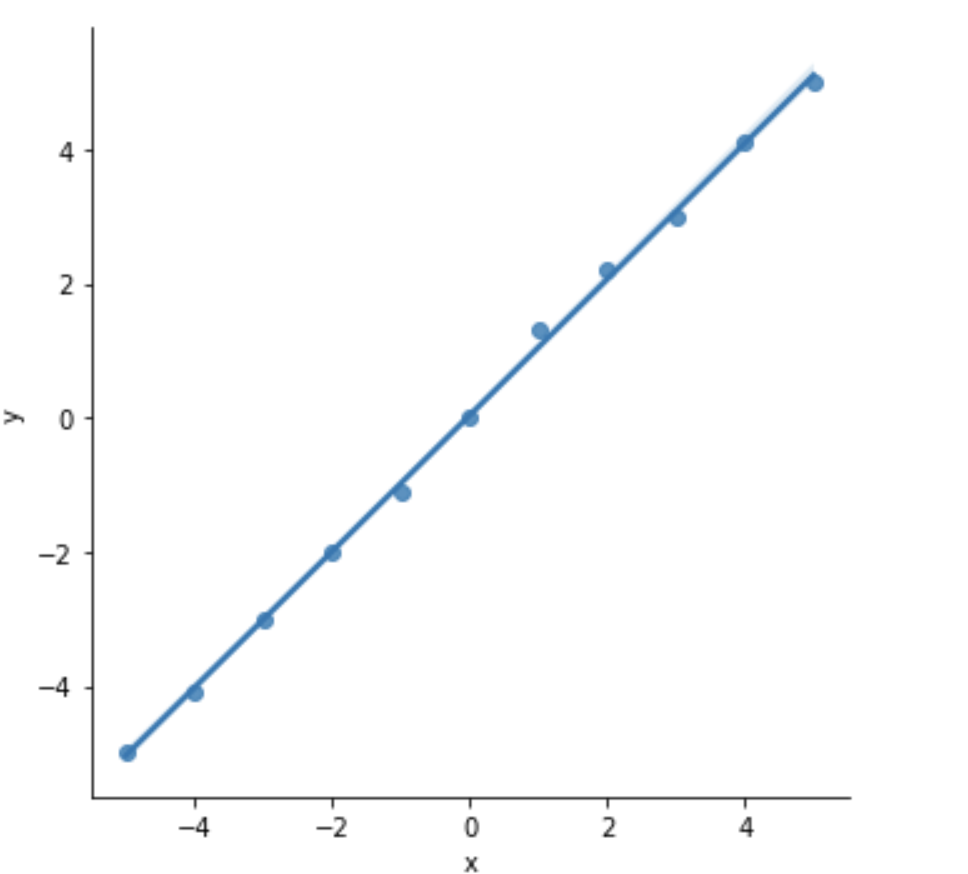

## Graphique de présentation heatmap

Prenons le nombre de passagers qui ont voyagé en avion de 1949 à 1960 dans la librairie seaborn :

```python
import seaborn as sns

flights = sns.load_dataset("flights")
flights.head()
```

Créons le pivot suivant : en ligne les mois et en colonne les années et reportons le nombre de passager par mois et par année dans ce nouveau DataFrame :

```python
flights = pd.crosstab(flights['month'], flights['year'], values=flights['passengers'], aggfunc='sum')
flights.head()
```

Notez que vous pouvez également utiliser la fonction pivot_table de pandas pour obtenir le même résulat :

```python
flights = sns.load_dataset("flights")

pd.pivot_table(flights, values='passengers', index=['month'],
                    columns=['year'], aggfunc=np.sum)
```

Puis maintenant représentons ce graphique à l'aide de heatmap pour mieux considérer ces données :

```python
%matplotlib inline
import matplotlib.pyplot as plt
import seaborn as sns
plt.figure(figsize=(15, 10))
ax = sns.heatmap(flights)
```

Vous pouvez également ajouter le nombre de passager sur le graphique :

```python
plt.figure(figsize=(15, 10))
ax = sns.heatmap(flights,annot=True, fmt=".0f", cmap="YlGnBu")
```

Le paramètre cmap indique la plage de couleur.

pour plus de précision sur la répartition de ces couleurs utilisez vmin et vmax entre les valeurs possibles de vos données.

Le paramètre fmt indique la taille de la typo dans les cellules du heatmap.

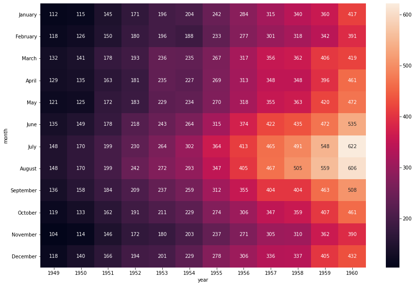


### 05 Exercice mpg 

Importez les données mpg de searborn dans votre Notebook

- 1. Combien de voiture sont-elles produites pour chaque région.

- 2. Représentez les données à l'aide d'un heatmap.

Nous aimerions avoir un heatmap de la forme suivante :

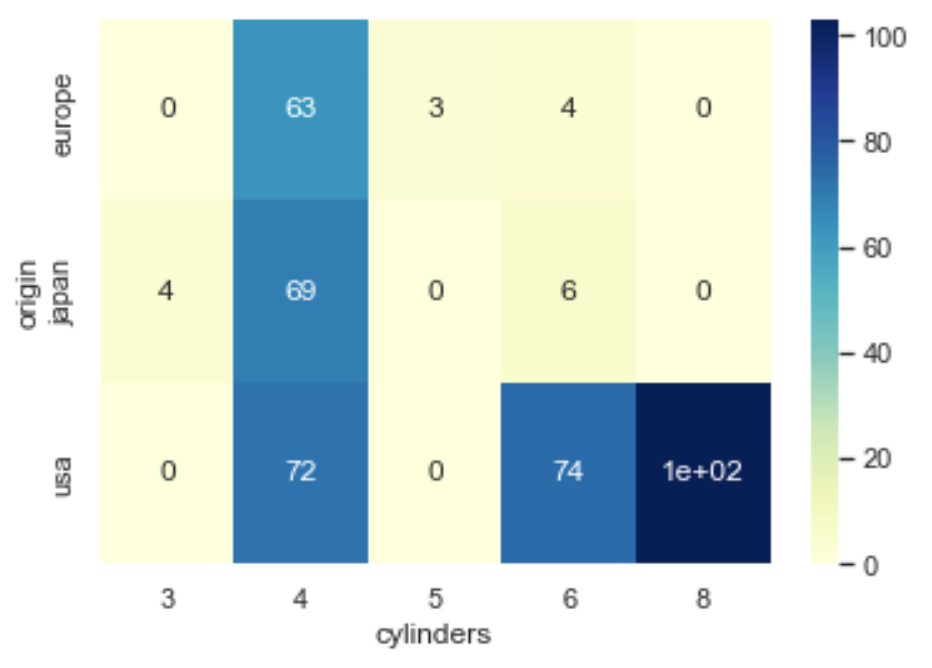

- 3. Représentez le diagramme des corrélations du dataset mpg

### 06 Exercice interprétation

Comment interprétez-vous le graphique suivant où on met en évidence les coefficients de corrélation pour les V.A. passanger et year ?

```python
plt.figure(figsize=(15, 10))
flights = sns.load_dataset("flights")
heatmap = sns.heatmap(flights.corr(), vmin=-1, vmax=1, annot=True)
```

Tracez la droite de régression à l'aide de la fonction suivante et vérifiez que les années et le nombre de passagers semblent corrélées.

```python
flights = sns.load_dataset("flights")

sns.lmplot(x="year", y="passengers", data=flights);
```

## Droite de régression

**Voir dans le dossier Examples de Notebooks le fichier Droite_regression.**

Rechercher une droite de régression linéaire, c'est rechercher une relation linéaire entre les variables X et Y. Dis autrement c'est rechercher une relation d'explication linéaire de Y par X. Par exemple on pourrait essayer d'expliquer l'espérance de vie Y en fonction de la natalité X avec un jeu de données correspodant.

On cherche à miniser la somme des distances en bleu ci-dessous. Ce sont les projections des points sur la droite D recherchée. Cette droite passe par un point remarquable qui est le centre de gravité du nuage de points noté G et qui a pour coordonnées la moyenne des X et Y (nos variables) : G(avg{X}, avg{Y})

On cherche ici une relation affine entre nos deux variables X et Y. On démontre que le cœfficient directeur de cette droite est donnée par la formule suivante :

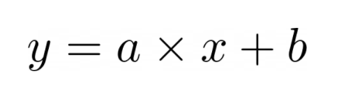

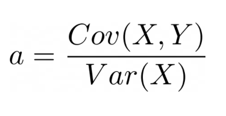

De plus on sait que cette droite passe par le centre de gravité du nuage de points. On a donc deux relations permettant de calculer les deux paramètres a et b et donc de déterminer l'équation de la droite (D) de régression.

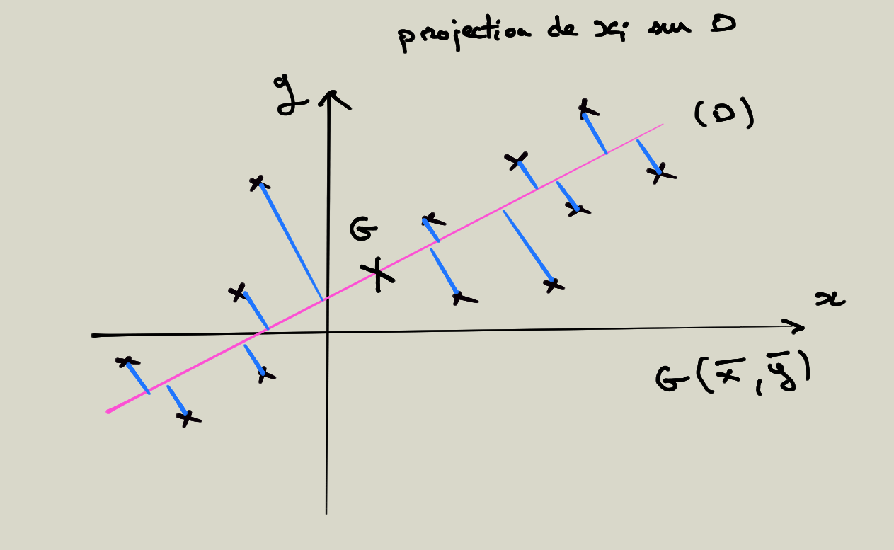


## Droite de régression seaborn

Importez le dataset diamonds de seaborn

```python
%matplotlib inline
import matplotlib.pyplot as plt
import seaborn as sns

diamonds = sns.load_data('diamonds')

diamonds.head()
```

Pour avoir une expression de la droite de régression nous devons utiliser une autre librairie (statistiques) :

```python
import statsmodels.api as sm
```

Puis définir quelques variables pour obtenir ce que nous recherchons :

```python
def fit_line(x, y):
    """Return slope, intercept of best fit line."""
    X = sm.add_constant(x)
    model = sm.OLS(y, X, missing='drop') # ignoré les NaN
    fit = model.fit()

    return fit.params[1], fit.params[0] 
```

