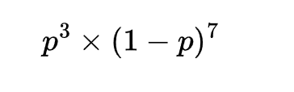
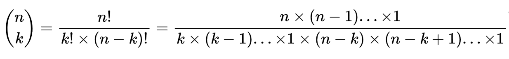
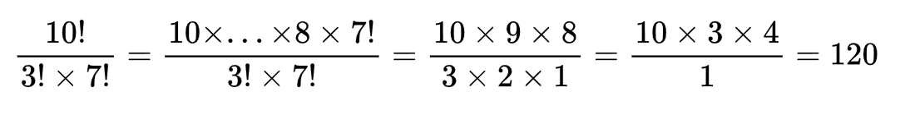
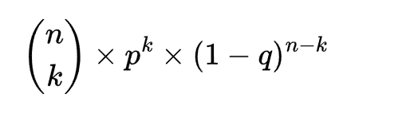
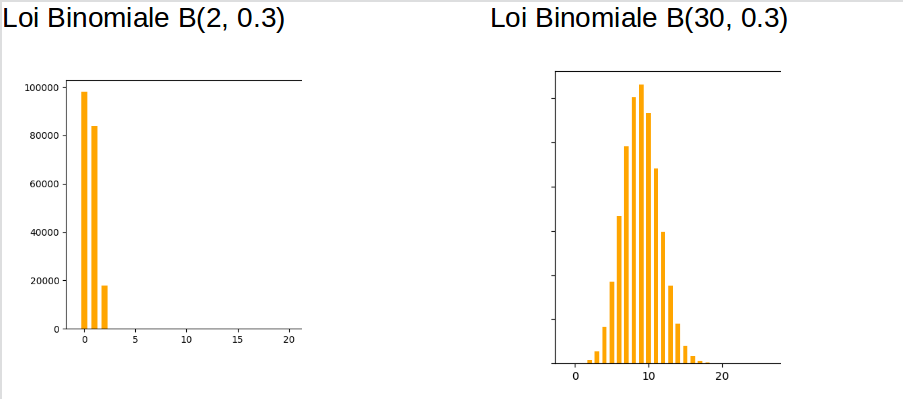
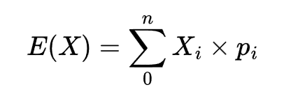

# Loi de Probabilité

## Loi de Bernoulli & Binomiale

La loi de Bernoulli en probabilité est une loi de probabilité discrète. Qui prend la valeur 1 avec la probabilité p et 0 avec la probabilité 1 - p. C'est une loi de probabilité qui n'a que deux issues possibles. Par exemple si on lance une pièce de monaie alors il n'y a que deux issues possibles : Pile ou Face. La probabilité d'obtenir Pile est 1/2 et Face 1/2, si la pièce est parfaitement équilibrée.

## Exercice d'application

Créez en Python la fonction de la loi de bernouilli.

```python
import random as r

def bernoulli(p):
    pass

```

## Expérience aléatoire

Si on prend l'expérience suivante : on lance successivement 10 fois une pièce de monnaie parfaitement équilibrée. Quelle est la probabilité d'obtenir 3 piles sur ces 10 lancers ?

L'événement élémentaire ici n'a que deux issues possibles : pile ou face. Comme la pièce est équilibrée on a autant de chance d'obtenir pile que face, donc la probabilité p est p = 0.5 et la probabilité de l'événement contraire est q = p - 1 = 0.5. Cet expérence est donc un expérience de Bernoulli (deux issues possibles).

Un événement possible est : **P**F**PP**FFFFFF, mais il y en a beaucoup d'autres ... Rappelons que le calcul de la probabilité est le rapport du nombre de cas favorables sur le nombre de cas possibles.

Il faut remarquer pour la suite que les événements sont indépendants entre eux.

Si on cherche à calculer la probabilité suivante : avoir 3 piles au trois premiers lancers et que des faces pour le reste des 10 lancers alors la probabilité recherchée est :




Mais dans notre expérience nous n'avons pas la notion d'ordre.

Il nous reste donc à compter combien de combinaison de 3 piles possibles parmi 10 lancers nous avons. Ce problème est un problème de dénombrement connu. Nous donnons ci-dessous la formule combinatoire pour compter le nombre de combinaisons possibles :



Où **n** est dans notre cas le nombre de lancers et **k** le nombre de succès, obtenir un pile.

On a donc :



Pour obtenir la probabilité recherché on appliquera la formule générale suivante :



## 01 Exercice d'application Binomiale

1. Créez une fonction **experience(n,p)** qui permet de simuler un lancer à l'aide de la fonction bernoulli.

2. On répète un grand nombre de fois cette expérience, comptez alors le nombre de fois que l'on obtient une combinaison de 3 piles parmi 10 lancers :

```python
experience(n,p) == 3
```

3. Donnez la probabilité recherchée.

4. Utilisez maintenant la méthode binomial de numpy elle renvoie une valeur représentant une réalisation de la loi binomiale. Il s'agit donc du nombre de succès à l'issue de n tentatives avec une probabilité p de succès à chaque fois. Il existe un troisième paramètre facultatif ici N dans l'exemple ci-dessous, permettant de générer un tableau de taille N. Cela permet de générer autant de valeurs que nécessaire. En utilisant cette méthode calculez la probabilité de la question 2.

```python
import numpy as np
n, p  N = 10, 0.5, 1000

np.random.binomial(n,p,N)
```

5. Tracez maintenant un histogramme pour les valeurs de n suivantes n = 2, 3, 4, 10, 100, 1000 avec une pièce truquée ayant comme probabilité p = 0.7 de tomber sur la pile. Utilisez seaborn et la méthode distplot, mettez le paramètre kde à True pour que seaborn trace une fonction d'interpollation sur le graphe. Que constatez-vous ?

## Loi Normale

Lorsque le paramètre n augmente, dans l'expérience de la loi Binomiale, l'asymétrie de la loi est contrariée, **elle a une forme en cloche.**



C'est le mathématicien français de Moivre qui découvrit que la loi Binomiale avait une forme Normale lorsque n était assez grand et ceci quelque soit la probabilité p.

Mais, ce qui es plus générale est en fait le théorème suivant, dit centrale limite:

"Des données qui dépendent de nombreux petits effets aléatoires indépendants sont approximativement distribués de manière Normale".

Ceci explique pourquoi on trouve la loi Normale partout : fluctuation des marchés financiers, moyennes des températures sur une année, maladies, etc.

La loi Normale est une loi de probabilité dite de densité, son intégrale de -infiny à +infiny vaut 1. **Et toute probabilité est une portion de l'aire de la loi Normale inférieur à 1.**

## Cas où X suit une loi Normale

- Soit X une variable aléatoire. Alors X suivra une loi Normale si :

* X suit l'influence d'un grand nombre de facteurs.

* Lorsque ces facteurs influençant cette variable sont tous indépendants entre eux.

* Pris isolément ils contribuent très faiblement à faire varier la quantité X.

Alors X suit une loi Normale.

### Exemple de variable X suivant une loi Normale

Si on s'intéresse par exemple au diamètre X (variable aléatoire) d'une pièce de voiture fabriquée par une machine. Alors la mesure de ces diamètres suit une loi Normale.

### Expérience mathématique

L'espérance de X est la valeur que l'on peut espérer obtenir, pour X, en moyenne, sur un grand nombre d'expériences. Elle est définie comme suit :




pi est la probabilité associée à Xi

L'espérance mesure la moyenne d'obtenir un succès. Dans l'exemple précédent, des 10 lancers de pièce successifs, l'espérance mathématique mesure la moyenne d'obtenir un succès, **c'est-à-dire d'obtenir un pile**.

L'espérance mathématique d'une loi Binomiale est :

```txt
E(X)= np
```